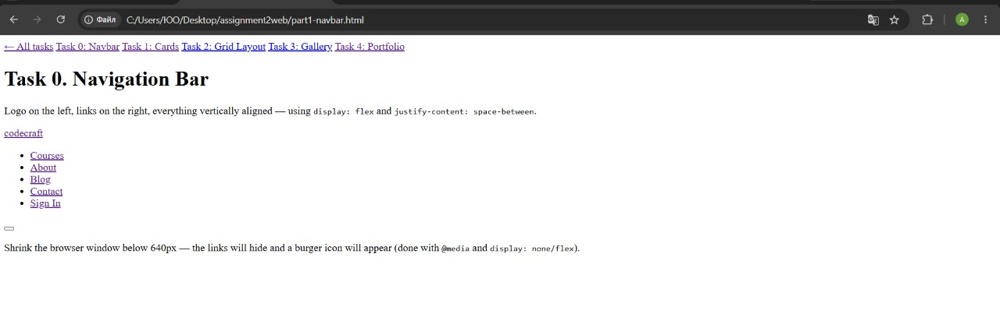
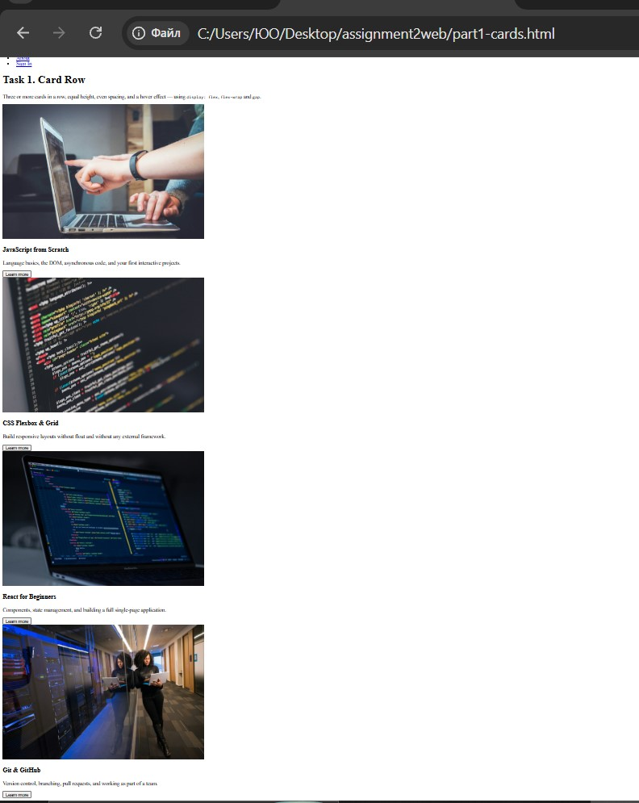
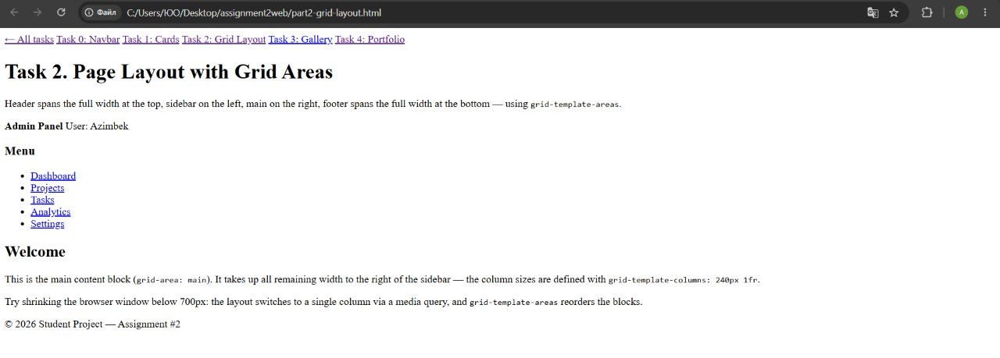
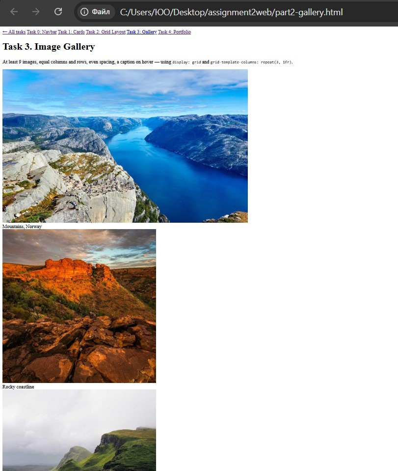
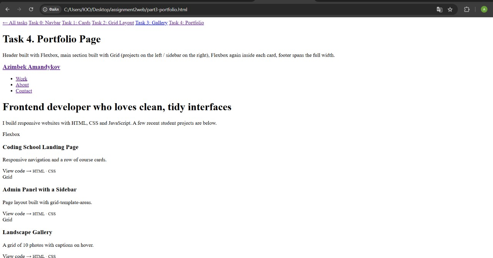

# Assignment #2 — Advanced CSS (Flexbox & Grid)

**Name:** Azimbelk Amandykov
**Group:** SE-2539

---

## Part 1. Flexbox

### Task 0. Navigation Bar
A header with the logo on the left and a list of links on the right. The
container is turned into a flex container
(`display: flex; justify-content: space-between; align-items: center;`),
and spacing between the links is handled with `gap`.

**Screenshot:**

### Task 1. Card Row
A row of 4 cards (image, title, text, button). The container is `flex`,
cards are stretched to equal height, spacing between them is even (`gap`),
and each card lifts up with a shadow on hover.

**Screenshot:**

---

## Part 2. Grid System

### Task 2. Page Layout with Grid Areas
A layout with header / sidebar / main / footer built using
`grid-template-areas`. The header spans the full width at the top, the
sidebar sits on the left, main sits on the right, and the footer spans
the full width at the bottom.

**Screenshot:**

### Task 3. Image Gallery
10 images inside a grid container (`repeat(3, 1fr)`), even spacing
between cells, and a caption that appears over each photo on hover.

**Screenshot:**

---

## Part 3. Combining Flexbox & Grid

### Task 4. Portfolio Page
Header built with Flexbox (navigation), main section built with Grid
(`2fr 1fr`: projects on the left, info block on the right), Flexbox again
inside each project card (column: tag → title → text → bottom row), and
a footer that spans the full width of the page.

**Screenshot:**

---

## Short description of the work process

I started each task by building the plain HTML structure first, then
added `display: flex` or `display: grid` to the container and worked out
the alignment with properties like `justify-content`, `align-items` and
`gap`. For the navbar and card row I relied on Flexbox to distribute and
align elements evenly, while the page layout and gallery used CSS Grid
with `grid-template-areas` and `repeat()` to create equal columns. The
most challenging part was combining both techniques on the portfolio
page — getting the Grid section (projects + sidebar) to work well with
Flexbox inside each card, and making sure the whole layout stayed
responsive on smaller screens using media queries.